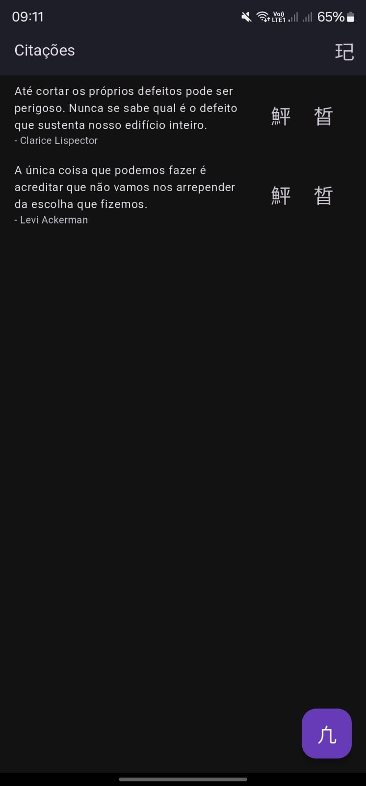
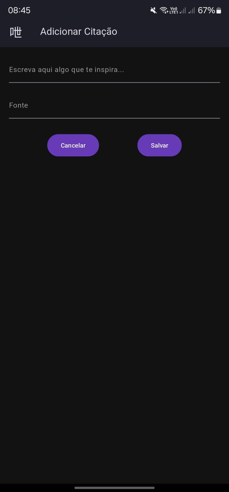
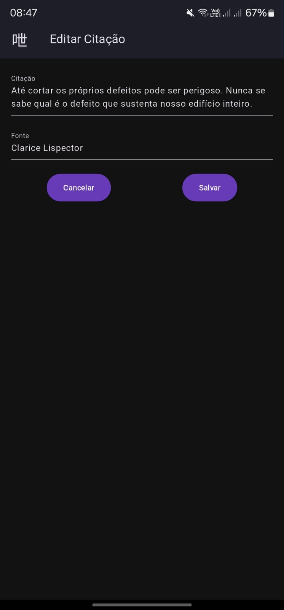
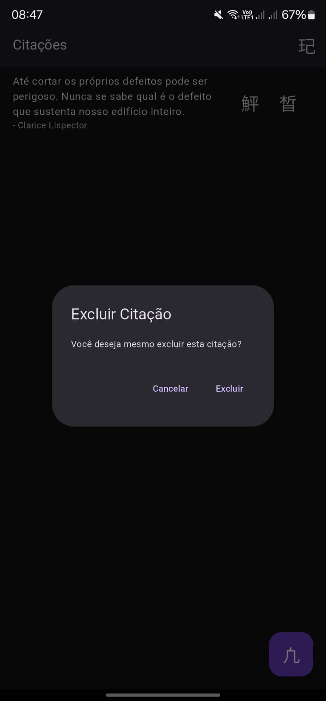
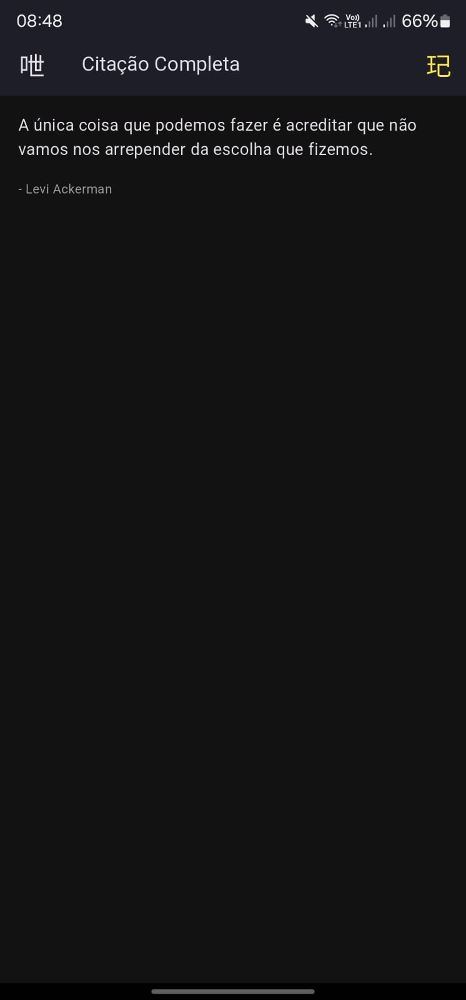
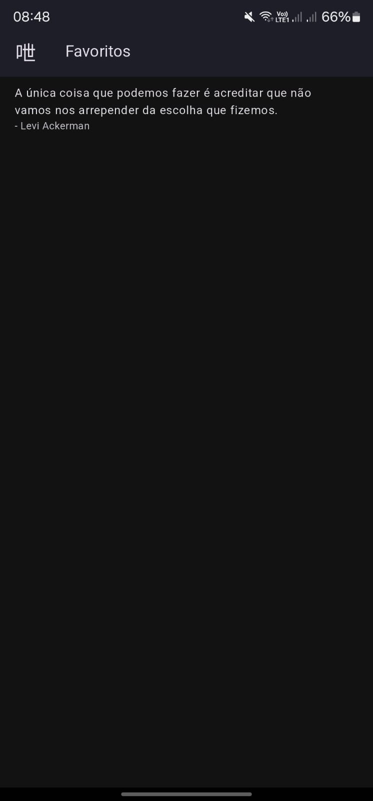

#  App Citações 📖✏️ 

> "Algumas palavras têm o poder de iluminar nossa mente, confortar nossa alma e transformar nossa visão de mundo. Uma única frase pode mudar um dia, um pensamento pode mudar uma vida. Registrar citações é como marcar as páginas mais impactantes de um livro—é dar destaque ao que nos toca, ao que nos move, ao que queremos guardar para sempre."

O **App Citações** é um aplicativo Android desenvolvido em Flutter que permite cadastrar, visualizar, editar, excluir e favoritar citações de forma organizada. O app foi projetado para facilitar o armazenamento de citações inspiradoras, oferecendo uma interface simples e intuitiva. Entretanto, devido a um erro na importação dos ícones, eles não são exibidos corretamente, sendo substituídos por caracteres chineses. Apesar disso, as funcionalidades permanecem acessíveis e funcionais.

## 🌟 Funcionalidades

### 🏠 Tela Inicial
Ao abrir o aplicativo, o usuário se depara com a tela inicial, onde são exibidas todas as citações cadastradas. Cada citação aparece até um certo limite de caracteres, e abaixo dela, o nome do autor é exibido em um tom acinzentado, precedido por um traço (exemplo: "- Clarice"). Caso a citação seja muito longa, não será completamente visível na tela inicial, mas basta tocar sobre ela para visualizá-la por completo.

Na parte inferior, há um botão para adicionar novas citações. No topo direito, há um botão que leva para a tela de favoritos. Ao lado de cada citação, existem dois botões: um para editar e outro para excluir. Apesar dos ícones não estarem corretos, suas funções são identificáveis ao toque.

### ➕ Adicionar uma Citação
Ao pressionar o botão de adicionar, o usuário é redirecionado para uma tela onde pode inserir uma nova citação. Há dois campos obrigatórios: um para o texto da citação e outro para o nome do autor. Caso um dos campos não seja preenchido, o usuário não pode salvar. A tela também conta com um botão de "Cancelar", que retorna para a tela inicial sem salvar as alterações.

### 📝 Editar uma Citação
Se o usuário desejar modificar uma citação, basta clicar no botão de edição ao lado dela. Isso o levará para uma tela idêntica à de adição, onde pode editar tanto o texto quanto o autor. Infelizmente os requisitos de preenchimento não se aplicam aqui, então é possível deixar a citação vazia ou sem o nome do autor. Após editar, o usuário pode cancelar ou salvar.

### ❌ Excluir uma Citação
Ao pressionar o botão de exclusão ao lado de uma citação, uma mensagem de confirmação é exibida, perguntando se o usuário deseja realmente excluir a citação. Caso confirme, a citação será removida permanentemente.

### 🔍 Visualizar Citação Completa
Se uma citação for longa e não aparecer completamente na tela inicial, o usuário pode clicar sobre ela para ser redirecionado para a tela de citação completa. Aqui, a citação é exibida na íntegra, acompanhada do nome do autor. 

Nesta tela, há dois botões no topo: um à esquerda para voltar e outro à direita para favoritar a citação. Esse último era para ser um ícone de estrela, mas devido ao erro na importação de ícones, não aparece corretamente. No entanto, ao pressioná-lo, ele muda de cor para amarelo, indicando que a citação foi favoritada. Caso o usuário clique novamente, ele volta ao estado original (branco), desfavoritando a citação.

### ⭐ Tela de Favoritos
Na tela inicial, no topo direito, há um botão que leva para a tela de favoritos. Todas as citações marcadas como favoritas aparecem nesta tela. Assim como na tela inicial, o usuário pode clicar em uma citação para visualizá-la completamente. O desfavoritamento só pode ser feito na tela de citação completa.

---

##  📸 Galeria de Imagens 

Abaixo está uma tabela com os prints do aplicativo, organizados por etapa:

| 🏠 Tela Inicial | ➕ Adicionar Citação |
|---|---|
|  |  |

| 📝 Editar Citação | ❌ Excluir Citação |
|---|---|
|  |  |

| 🔍 Visualizar Citação Completa | ⭐ Tela de Favoritos |
|---|---|
|  |  |

---

## 📥 Download

Para instalar o aplicativo em seu dispositivo Android, baixe o arquivo APK disponível no repositório:

[📥 Baixar App Citações](app-citacoes.apk)

Caso tenha alguma sugestão ou feedback, fique à vontade para contribuir! 😊

